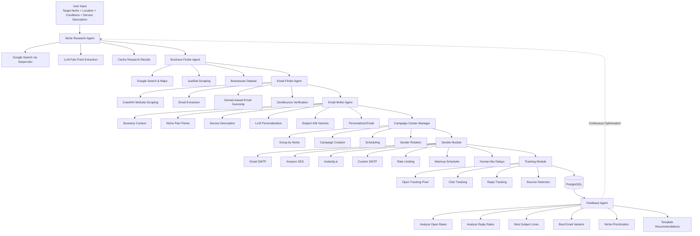

# Syntrase — Product Vision & Feature Spec

> The world's first fully open-source, self-hostable, AI-powered outreach agent.
> Research → Personalize → Send → Learn. All automated. All yours.

---

## The Problem

Cold outreach tools today are either:
- **Too expensive** — Instantly.ai ($37/month), Apollo ($99/month), Lemlist ($59/month)
- **Too dumb** — Generic templates, no real personalization
- **Too closed** — Cloud-only, no self-hosting, vendor lock-in
- **Too limited** — Only B2B, only email, only one LLM

**Nobody has built an open-source, self-hostable, AI-first outreach agent that does everything end-to-end.**

---

## The Solution

**Syntrase** — An autonomous AI agent that:

1. Takes your target (niche + location) as input
2. Researches businesses and their pain points intelligently
3. Finds verified contact emails
4. Writes hyper-personalized emails using AI
5. Sends them via your preferred sender (Gmail / SES / SMTP / Instantly)
6. Tracks opens, clicks, replies, bounces
7. Learns weekly — doubles down on what works, drops what doesn't

**One Docker command. Zero monthly fees. Fully yours.**

---

## Who Is This For

### B2B Use Cases:
- **Agencies** (like Syntrase users) — pitch software services to target businesses
- **Freelancers** — pitch development, design, or consulting services
- **SaaS founders** — reach potential customers at scale
- **Consultants** — pitch strategy, marketing, finance services

### B2C Use Cases:
- **Job seekers** — reach out to funded startups, companies hiring
- **Freelancers** — cold pitch to potential clients directly
- **Students** — reach internship opportunities at target companies

---

## Core Philosophy

```
Pluggable Everything.

LLM        → OpenRouter / Ollama (local) / OpenAI / Anthropic
Sender     → Gmail SMTP / Amazon SES / Instantly.ai / Custom SMTP
Database   → PostgreSQL / Supabase / SQLite
Hosting    → Local / Docker / Cloud (AWS, GCP, Railway)
Research   → Serper.dev / Tavily / Custom
```

If you have a good laptop → Run everything free.
If you want scale → Plug in paid services.

---

## System Architecture


---

## Full Feature List

### 🔍 Research Features
- [ ] Niche-first pain point research (one-time per niche, cached)
- [ ] Google Search integration via Serper.dev
- [ ] Google Maps local business extraction
- [ ] JustDial / IndiaMart scraping for Indian businesses
- [ ] Website crawling via Crawl4AI
- [ ] Business description extraction
- [ ] Industry + company size inference
- [ ] Decision maker role identification per niche

### 📧 Email Finding Features
- [ ] Website scraping for mailto links
- [ ] Regex email extraction from HTML
- [ ] Domain pattern guessing (info@, contact@, name@)
- [ ] Email verification via ZeroBounce API
- [ ] Bounce protection — skip unverified
- [ ] Contact deduplication

### ✍️ Email Writing Features
- [ ] Hyper-personalized email per business
- [ ] Niche pain point injection
- [ ] A/B subject line variants (2-3 per email)
- [ ] Multiple email types: Service pitch / Job application / Freelance
- [ ] Tone customization (formal / friendly / direct)
- [ ] Custom sender introduction (your company desc)
- [ ] Follow-up email sequences (3-4 emails)
- [ ] Unsubscribe link injection

### 📤 Sending Features
- [ ] Gmail SMTP multi-account rotation
- [ ] Amazon SES integration
- [ ] Instantly.ai API integration
- [ ] Custom SMTP support (Postal, etc.)
- [ ] Per-account daily rate limiting
- [ ] Human-like send delay (randomized)
- [ ] Warmup scheduler (ramp up slowly)
- [ ] Schedule sends by time of day (IST)
- [ ] Weekday-only sending option

### 📊 Tracking Features
- [ ] Open tracking (invisible pixel)
- [ ] Click tracking (URL wrapper)
- [ ] Reply detection (IMAP polling)
- [ ] Bounce handling
- [ ] Unsubscribe handling
- [ ] Per-campaign analytics
- [ ] Per-niche analytics
- [ ] Weekly performance report

### 🧠 Learning & Optimization
- [ ] Weekly feedback agent run
- [ ] Niche performance ranking
- [ ] Template performance analysis
- [ ] Subject line A/B winner detection
- [ ] Auto-skip low-performing niches
- [ ] Auto-prioritize high-performing niches
- [ ] Segment analysis (company size, location)

### 🔧 Configuration & Pluggability
- [ ] Pluggable LLM (OpenRouter / Ollama / OpenAI / Anthropic)
- [ ] Pluggable sender (Gmail / SES / Instantly / SMTP)
- [ ] Pluggable DB (PostgreSQL / Supabase / SQLite)
- [ ] Pluggable search (Serper / Tavily)
- [ ] .env based config — no code change needed
- [ ] Pydantic BaseSettings — type-safe config

### 🐳 DevOps & Deployment
- [ ] Single Docker Compose — everything runs together
- [ ] Cron scheduler built-in (research 9AM, feedback 6PM)
- [ ] PostgreSQL containerized
- [ ] Alembic migrations — DB version control
- [ ] Volume mounts — data persists on host
- [ ] IST timezone support
- [ ] Log rotation (Loguru)
- [ ] Weekly CSV backup via cron

### 🖥️ Frontend Dashboard (Phase 2)
- [ ] Campaign creation wizard
- [ ] Input form (target, conditions, type, about)
- [ ] Campaign list with status
- [ ] Per-campaign analytics charts
- [ ] Niche comparison dashboard
- [ ] Email preview before send
- [ ] Manual approve before sending
- [ ] Reply inbox (unified)
- [ ] Settings page (sender, model, API keys)

### ☁️ Cloud Hosting (Phase 2)
- [ ] Hosted version (pay-as-you-go)
- [ ] User accounts + auth
- [ ] Multi-tenant support
- [ ] Billing integration
- [ ] Usage dashboard

---

## Database Schema

### campaigns
```sql
id, name, niche, target_location, outreach_type,
status, total_sent, total_opened, total_replied,
total_bounced, open_rate, reply_rate,
created_at, started_at, completed_at, config (jsonb)
```

### businesses
```sql
id, campaign_id, name, website, industry,
location, city, country, description,
pain_points (jsonb), niche, source_url, scraped_at
```

### contacts
```sql
id, business_id, full_name, email,
email_verified, job_title, source, found_at
```

### email_records
```sql
id, contact_id, business_id, campaign_id,
subject, body, variant, status,
sent_at, opened_at, replied_at, bounced_at,
open_count, tracking_pixel_id
```

### niche_research_cache
```sql
id, niche, pain_points (jsonb), software_gaps (jsonb),
decision_makers, researched_at, is_stale
```

### feedback_reports
```sql
id, campaign_id, week_number, open_rate, reply_rate,
best_subject, best_variant, insights (jsonb),
next_action, generated_at
```

---

## Tech Stack Summary

| Layer | Technology | Why |
|---|---|---|
| Agent Orchestration | LangGraph | Stateful pipelines, loops, branches |
| LLM (default) | OpenRouter + Gemini Flash | Free/cheap, fast |
| LLM (local) | Ollama | Zero cost, private |
| Web Search | Serper.dev | Google Search API |
| Web Scraping | Crawl4AI | LLM-ready output, async |
| Email Verification | ZeroBounce | Accuracy, free tier |
| Sending (free) | Gmail SMTP / aiosmtplib | Zero cost |
| Sending (scale) | Amazon SES | ₹1200/mo, reliable |
| Sending (managed) | Instantly.ai | $37/mo, warmup included |
| Campaign Manager | Listmonk (optional) | Open source, self-hosted |
| Backend | FastAPI | Async, Python, REST API |
| Frontend | Next.js + Tailwind | Modern, fast |
| Database | PostgreSQL | Robust, scalable |
| ORM | SQLAlchemy (async) | Multi-DB support |
| Migrations | Alembic | Version controlled schema |
| Config | Pydantic BaseSettings | Type-safe .env |
| Package Manager | UV | Fast, modern |
| Logging | Loguru | Structured, rotating |
| Retry | Tenacity | Resilient API calls |
| Containerization | Docker + Compose | One command deploy |
| Scheduling | Cron (in Docker) | Automated runs |
| Hosting | Railway / Render / VPS | Phase 2 cloud |

---

## Competitive Positioning

| Feature | Syntrase | Instantly.ai | Apollo.io | Lemlist |
|---|---|---|---|---|
| Open Source | ✅ | ❌ | ❌ | ❌ |
| Self-hostable | ✅ | ❌ | ❌ | ❌ |
| AI Research Agent | ✅ | ❌ | Partial | ❌ |
| Pluggable LLM | ✅ | ❌ | ❌ | ❌ |
| Pluggable Sender | ✅ | ❌ | ❌ | ❌ |
| Local LLM support | ✅ | ❌ | ❌ | ❌ |
| B2B + B2C | ✅ | B2B only | B2B only | B2B only |
| Free tier | ✅ Full | ❌ | Limited | Limited |
| One Docker deploy | ✅ | ❌ | ❌ | ❌ |
| Indian market fit | ✅ | Partial | ❌ | ❌ |
| Monthly cost (min) | ₹0 | ₹3,100 | ₹8,000 | ₹4,900 |

---

## Monetization (Phase 3)

| Stream | How | Revenue potential |
|---|---|---|
| Cloud hosted version | Pay per campaign / subscription | ₹999-4999/month per user |
| Managed onboarding | Setup + config service via Syntrase | ₹10,000-25,000 one-time |
| Premium templates | Niche-specific email template packs | ₹499-1999 per pack |
| API access | Developers build on top | Usage based |
| Enterprise | Custom deployment + support | ₹50,000+/month |

---

## Open Source Strategy

- **License:** MIT (most permissive — maximum adoption)
- **GitHub:** Public repo, good README, proper docs
- **Docker Hub:** Pre-built images
- **Community:** Discord server for users
- **Contributions:** Issues, PRs welcome
- **Differentiator:** "Run everything free with one Docker command"

---

*Built by Syntrase — Mumbai.*
*Founded by Fareed — B.E. Computer Science, Rizvi College of Engineering.*